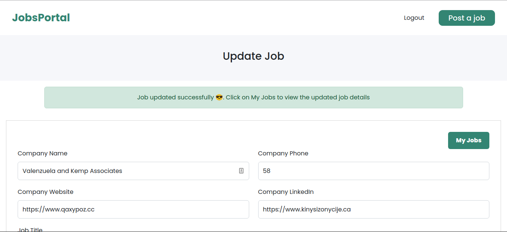

# Jobs Portal Web App
## By Maureen Njihia on 8th December 2022
# Description
Moringa Phase 4 Independent Project on a Jobs Portal Web App that allows users to:
* View various jobs `GET/jobs`
* View various job categories `GET/categories`
* Create a new job `POST/jobs`
* Update a details of a specific job `PATCH/jobs`
* Delete a job `DELETE/jobs`

# Setup Requirements
* Git
* Github
* Web Browser (Chrome or Firefox)
* Ruby on Rails API (https://api.rubyonrails.org/)
* SQLite3 Database

# Setup Installation 
* Copy the link of this repository
```
$ https://github.com/Njihia413/phase-4-project.git
```
* Clone it to your local machine
```
$ git clone https://github.com/Njihia413/phase-4-project.git
```
* Open the terminal and navigate to the directory of the project
```
$ cd phase-4-project
```
* Navigate to the client folder and install the required dependencies
```
$ cd client
$ npm install 
$ npm update
```
* Navigate to the parent folder of the client and install ruby on rails
```
$ cd ..
$ gem install rails
```
* Run the migrations and seed the data
```
$ rails db:migrate db:seed
```
* Start the rails server
```
$ rails s
```
* Open a new terminal and start the client
```
$ npm start --prefix client
```
* To view the server, navigate to http://localhost:3000/jobs
* TO view the client application, navigate to http://localhost:4000

# Technologies Used
* ReactJS
* CSS3
* Ruby on Rails
* SQLite3 Database

# Live Links
Backend Live Links:
* https://jobs-portal-production.up.railway.app/jobs
* https://jobs-portal-production.up.railway.app/categories


# Some Screenshots
* Homepage


<br />

* `GET/categories`


<br />

* `GET/jobs` 


<br />

* `GET/jobs/:id`


<br />

* `POST/jobs`


<br />

* `PATCH/jobs/:id`


<br />

* `DELETE/jobs/:id`


<br/>

* My Jobs List


<br/>

* Signup Page


<br/>

* Login Page


<br/>

# Known Bugs
There are no known bugs of this project at the moment 😎.
# Support and contact details
For any contributions towards this project:
* Email: developer.njihia@gmail.com
* Phone: 0704592362
# License
Copyright (c) 2022 Moringa School

Permission is hereby granted, free of charge, to any person obtaining
a copy of this software and associated documentation files (the
"Software"), to deal in the Software without restriction, including
without limitation the rights to use, copy, modify, merge, publish,
distribute, sublicense, and/or sell copies of the Software, and to
permit persons to whom the Software is furnished to do so, subject to
the following conditions:

The above copyright notice and this permission notice shall be
included in all copies or substantial portions of the Software.

THE SOFTWARE IS PROVIDED "AS IS", WITHOUT WARRANTY OF ANY KIND,
EXPRESS OR IMPLIED, INCLUDING BUT NOT LIMITED TO THE WARRANTIES OF
MERCHANTABILITY, FITNESS FOR A PARTICULAR PURPOSE AND
NONINFRINGEMENT. IN NO EVENT SHALL THE AUTHORS OR COPYRIGHT HOLDERS BE
LIABLE FOR ANY CLAIM, DAMAGES OR OTHER LIABILITY, WHETHER IN AN ACTION
OF CONTRACT, TORT OR OTHERWISE, ARISING FROM, OUT OF OR IN CONNECTION
WITH THE SOFTWARE OR THE USE OR OTHER DEALINGS IN THE SOFTWARE.